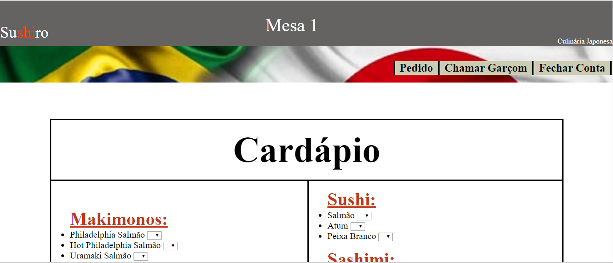
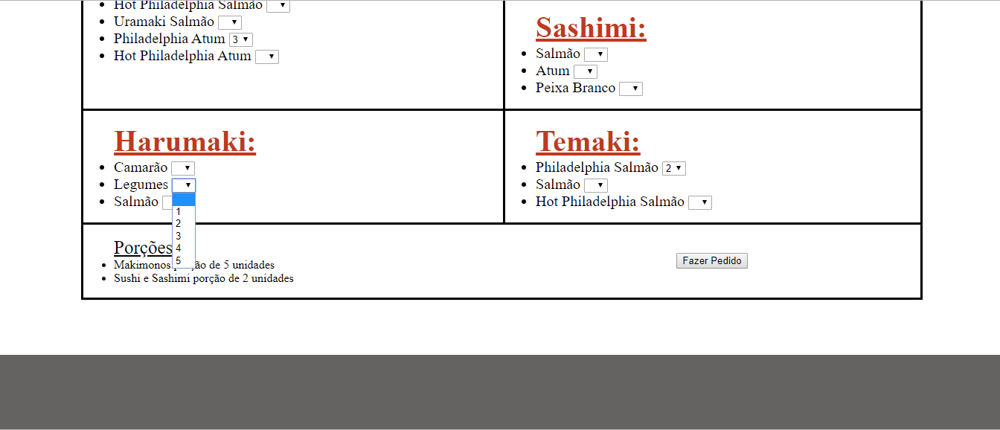
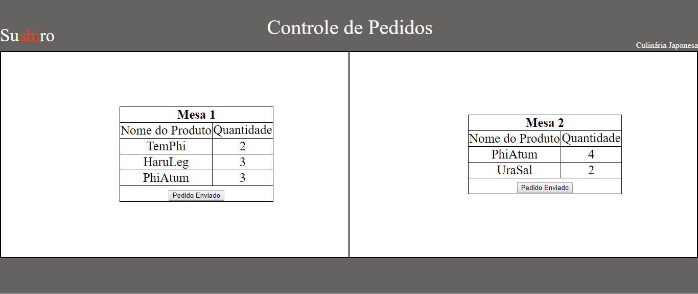
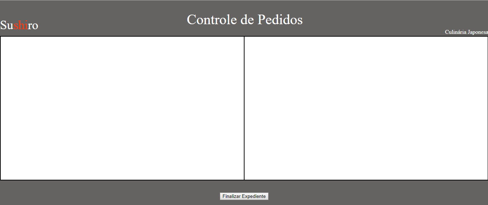
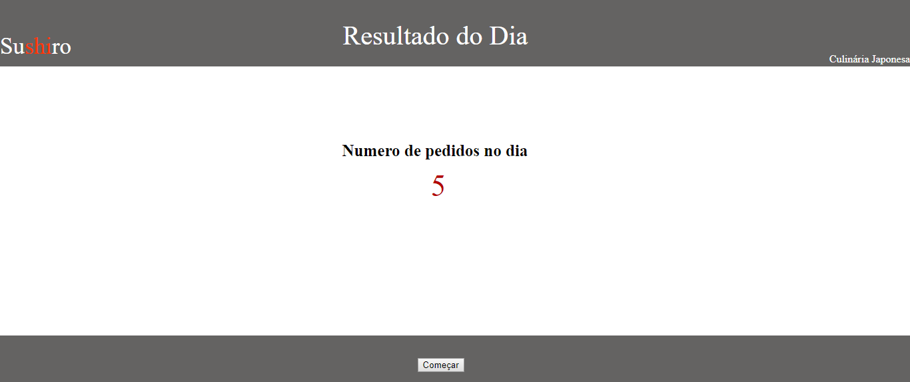
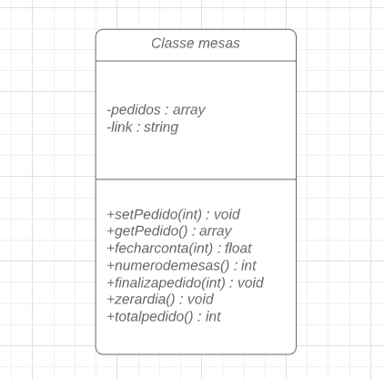
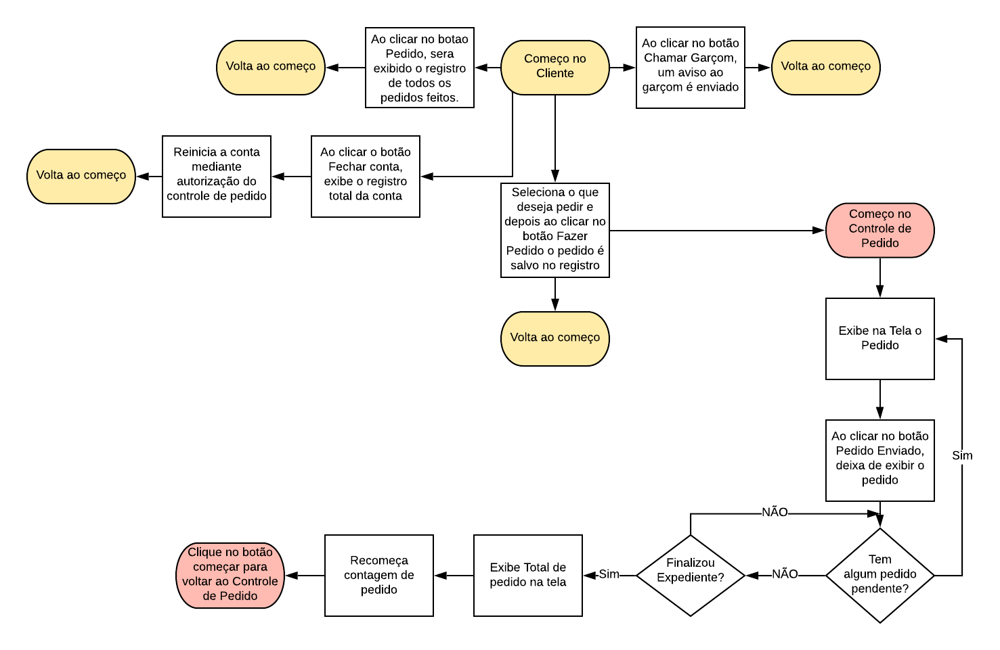

# Serviço de Restaurante :plate_with_cutlery:

# Sumário
<ol>
<li><a href="#Moti">Portabilidade</a></li>
<li><a href="#Impl">Implementação</a></li>
<li><a href="#Inter">Interface Gráfica</a></li>
<li><a href="#Tuto">Tutorial</a></li>
<li><a href="#Diag">Diagrama de Classes</a></li>
<li><a href="Flux">Fluxograma</a></li>
</ul>

## <a name="Moti">Motivação</a>

Dos restaurantes que ja frequentei, a maioria dele possuía um garçom que ignorava as pessoas para não ser chamado ou então que prestava um mal atendimento.

Desta forma, surgiu a ideia de criar uma plataforma onde os clientes pudessem ter a opção de pedir a comida por algum aparelho sem a necessidade de um garçom vir a mesa para isso ou ate mesmo chamar o garçom por este mesmo aparelho

## <a name="Impl">Implementação</a>

A linguagem escolhida para implementar esta plataforma foi a Web, sendo o principal motivo desta escolha o meu conhecimento prévio de como programar a interface gráfica, pois devido ao curto tempo e diversas outras demandas, não teria como aprender muita coisa para implementar as mínimas funcionalidades que desejava

## <a name="Inter">Interface Gráfica</a>
### Aba do cliente
<ul>Aqui nós temos a interface gráfica do cliente, onde ele pode:
<li>A partir de um cardápio completo do restaurante, escolher a quantidade</li>
<li>Ver quantos pedidos ja realizou e o total da sua conta ate o momento</li>
<li>Chamar o garçom para que seja realizado um atendimento pessoal</li>
<li>Pedir para fechar sua conta</li>
</ul>
<bdi>Segue imagens</bdi>

 

### Aba do Controle de Pedidos
<ul>Aqui nós temos a interface do operador do controle de pedidos, onde ele pode:
<li>Visualizar na mesma hora o produto pedido pelo cliente e sua quantidade, onde estará indicado em qual mesa foi feito o pedido</li>
<li>Emitir que o pedido ja esta pronto</li>
<li>Caso todos os pedidos ja tenham sido emitidos, podemos clicar numa opção de finalizar o trabalho do dia, o qual salvará um arquivo com registro de todos os pedidos naquele dia e reproduzira na tela a quantidade de pedidos no dia e o quanto de dinheiro entrou</li>
</ul>

 

 

## <a name="Portab">Portabilidade</a>

Apesar de ter colocado um exemplo com Restaurante Japones e 2 mesas, podemos facilmente adaptar para quantas mesas quisermos e qualquer tipo de restaurante

## <a name="Tuto">Tutorial para utilizar o projeto</a>
<ol>Para poder utilizar este projeto tem que seguir o seguinte passo-a-passo:
<li>Acesse o este <a href="https://www.apachefriends.org/pt_br/download.html">link</a> e instale o programa</li>
<li>No terminal do SQL digite os seguintes <a href="Tutorial/DB.txt">códigos</a> que estão em um bloco de notas</li>
<li>Baixe o projeto todo e colo que na pasta <b><ins>C:\xampp\htdocs</ins></b></li>
<li>Agora é so utiliza o <b><ins>mesa1.php</ins></b> e <b><ins>mesa2.php</ins></b> para controlar a aba do cliente e <b><ins>dono.php</ins></b> para controlar a aba do controle de pedidos</li>
 </ol>

## <a name="Diag">Diagrama de Classes</a>

Abaixo nos temos o diagrama de classes implementado em PHP para este projeto

 

## <a name="Flux">Fluxograma</a>

Abaixo nós temos o Fluxograma o projeto implementado

