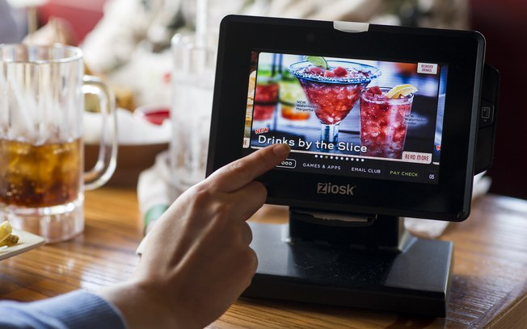

# Serviço de Restaurante :plate_with_cutlery:

## Motivação

Dos restaurantes que ja frequentei, a maioria dele possuía um garçom que ignorava as pessoas para não ser chamado ou então que prestava um mal atendimento.

Desta forma, surgiu a ideia de criar uma plataforma onde os clientes pudessem ter a opção de pedir a comida por algum aparelho sem a necessidade de um garçom vir a mesa para isso ou ate mesmo chamar o garçom por este mesmo aparelho

## Implementação

A linguagem escolhida para implementar esta plataforma foi a Web, sendo o principal motivo desta escolha o meu conhecimento prévio de como programar a interface gráfica, pois devido ao curto tempo e diversas outras demandas, não teria como aprender muita coisa para implementar as mínimas funcionalidades que desejava

## Interface Gráfica
### Aba do cliente
<ul>Aqui nós temos a interface gráfica do cliente, onde ele pode:
<li>A partir de um cardápio completo do restaurante, escolher a quantidade</li>
<li>Ver quantos pedidos ja realizou e o total da sua conta ate o momento</li>
<li>Chamar o garçom para que seja realizado um atendimento pessoal</li>
<li>Pedir para fechar sua conta</li>
</ul>
<bdi>Segue imagens</bdi>

 

### Aba do Controle de Pedidos
<ul>Aqui nós temos a interface do operador do controle de pedidos, onde ele pode:
<li>Visualizar na mesma hora o produto pedido pelo cliente e sua quantidade, onde estará indicado em qual mesa foi feito o pedido</li>
<li>Emitir que o pedido ja esta pronto</li>
<li>Caso todos os pedidos ja tenham sido emitidos, podemos clicar numa opção de finalizar o trabalho do dia, o qual salvará um arquivo com registro de todos os pedidos naquele dia e reproduzira na tela a quantidade de pedidos no dia e o quanto de dinheiro entrou</li>
</ul>

 

 

## Portabilidade

